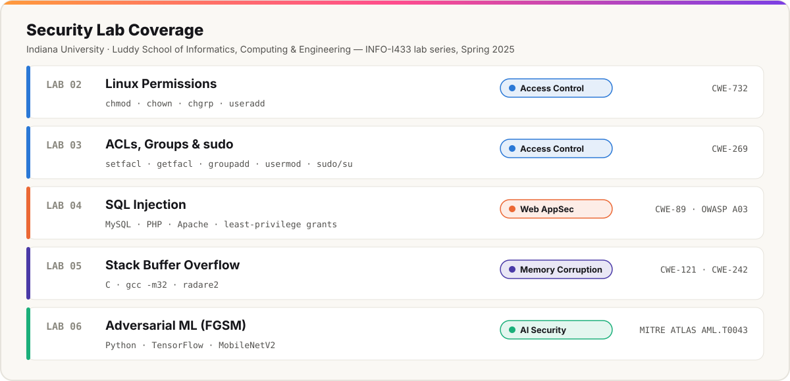

# 🔐 Security Labs

Hands-on offensive and defensive security labs from Indiana University's Luddy School of Informatics, Computing & Engineering (INFO-I433, Spring 2025). All work was done in isolated, instructor-provided lab VMs and lab servers.

| # | Lab | Domain | Maps to | Key skills |
|---|---|---|---|---|
| 02 | [Linux Permissions & Access Control](lab-02-linux-permissions/) | Access Control | CWE-732 | UNIX permission bits, ownership, least-privilege directory design |
| 03 | [ACLs, Groups & Privilege Management](lab-03-acls-and-sudo/) | Access Control | CWE-269 | POSIX ACLs, group design, `sudo` vs `su` |
| 04 | Web App Deployment & SQL Injection | Web AppSec | CWE-89 · OWASP A03:2021 | LAMP deployment, least-privilege DB users, auth bypass, blind schema enumeration |
| 05 | Stack Buffer Overflow | Memory Corruption | CWE-121 · CWE-242 | C, 32-bit stack layout, radare2, overwriting adjacent variables |
| 06 | Adversarial ML with FGSM | AI Security | MITRE ATLAS AML.T0043 | TensorFlow, MobileNetV2, gradient-based evasion, model robustness |

## How each writeup is organized

1. **Objective:** what the lab set out to show
2. **Approach:** tools and method, in my own words
3. **Findings:** what I observed
4. **Defensive takeaways:** how to prevent or detect it in a real environment

> **Academic integrity note:** These are summaries of technique and lessons learned. They are not answer keys. Course handouts, grading, and exact question answers are left out on purpose.

## Author

**Henery "Benji" Cash** · [LinkedIn](https://www.linkedin.com/in/hccash) · [GitHub profile](https://github.com/Cashh2)
